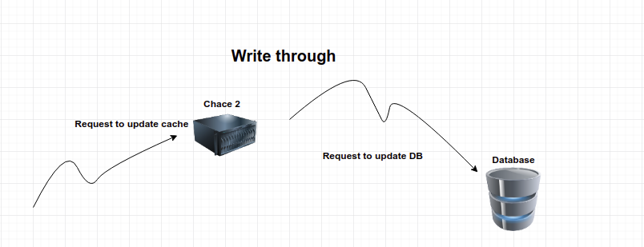
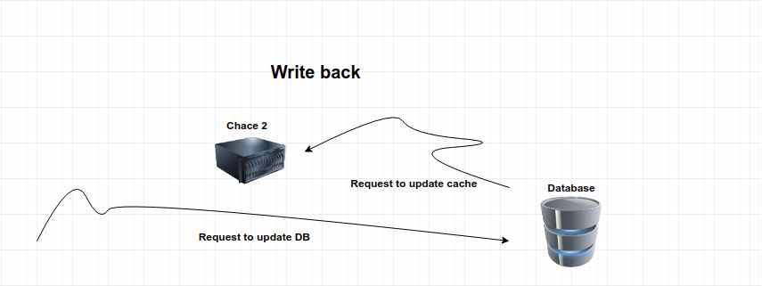

Through my journey in the development industry, I have been discovering more and more.
tried to develop and enhance my skills in front-end, backend, and even cross-platform mobile development

though I felt I can see the bigger picture and I did, I decided to put more time to invest in my backend skills.

so this is my first article about the tech and skills I miss as a back-end developer.

#### Server Side Mem-Caching

Server-side caching is the technique used to cache commonly used data on a server to decrease the hits on the DB whenever the data is needed but there are another use cases we will discuss in this article

#### Use cases

##### Decreasing response time 
As data is cached in server memory this allows the server to have a better data retrieval performance and this should lead to faster response time.

##### Avoiding repeated computation 
As if we working on a dashboard that shows the total revenue in the previous month. with large data, this is an expensive computation so we can do it once and caching it.

##### Reducing DB hits
As mentioned above we can reduce DB hits if we cached frequently required data, so simple can't explain more.

#### When NOT to use

1. As you can see if the required data is missing we will have to hit the database and caching it and this may lead to increasing the response.

2. Caching so much data will also lead to bad performance.

3. If cached data are frequently modified this can lead to inconsistency
because you will need to recache data every time you update this data in the database
other problem is synchronization in case of distributed systems probably you will have outdated cache in a place or other. 

#### Caching Techniques
##### Write-through

Using this technique we first apply changes to cache and after then we apply those changes to the database.

##### Write-through cons
In a scenario when you have multiple caches on many multiple servers you will have outdated data stored in one of your cache stores.

##### Write-back 


Using this technique we apply changes to the database first and then either update cache or delete the entry so whenever the data is needed you will hit the cache and if it's missing we will request a new fresh data from the database.

##### Write-back cons
Sending requests from a database to update your cache could be expensive and may lead to bad performance.

##### Hyperd Technique
We can use both write back and write through techniques based on the importance of data. 
we can ignore updating data in the cache with a write-back technique if this data is not important as of comments, likes or something similar. 

#### Introducing Redis

As mentioned on the official page: <a href="https://redis.io/" target="_blank">Redis official page</a>

Redis is an open source (BSD licensed), in-memory data structure store, used as a database, cache and message broker.


##### Example

this example will be written using nodejs so it's better to be familiar with js
start by <a href="https://redis.io/download" target="_blank">downloading Redis</a>, it's available for all operating systems

create a folder and navigate to it and then open your cmd or terminal and type 
````bash
npm init
````
this will walk you through creating a package.json file 
after then we need to install some packages
1. expressjs - a minimalist web framework for Node.js
2. Redis - seriously it's our topic

````bash
npm i express redis
````
then creating an app.js file

first, we start by importing dependencies and creating our web server
```js
const express = require('express');

// Set Port
const port = 3000;

// Init app
const app = express();

app.listen(port, function(){
    console.log('Server started on port '+port);
});
```
second, we establish a connection with redis

```js
const redis = require('redis');

// Create Redis Client
let client = redis.createClient();

//lestinig to redis connection
client.on('connect', function(){
    console.log('Connected to Redis...');
});

```
third, we add our endpoints and we get our final result
```javascript
const express = require('express');
const redis = require('redis');

// Create Redis Client
let client = redis.createClient();

client.on('connect', function(){
    console.log('Connected to Redis...');
});

// Set Port
const port = 3000;

// Init app
const app = express();

const getBook = function (name) {
    client.hgetall(name, function(err, obj){
        if(!err) return obj;
        console.log(err);
    });
}

const addBook = function (name, {author, aspn}) {
    client.hmset(name, [
        'author', author,
        'aspn', aspn,
        'name', name,
    ], function(err, book){
        if(err){
            console.log(err);
        }
        console.log(book);
        res.json({message: 'success', book:book});
    });
}

// Search for book end point
app.post('/search', function(req, res, next){
    let name = req.body.name;
    let book = getBook(name);
     if(book) {
        res.json({message: 'success', book:book});
    } else {
        // this is the place where we hit database
        // and search for the book 
        // if found we add it to the cache
        // addBook(name, {author, aspn});
    }
});

// Add Book end point
app.post('/add', function(req, res, next){
    let name = req.body.name;
    addBook(name, req.body);
    // Note we should also add the book to DB

});

// Delete Book end point
app.delete('/delete/:aspn', function(req, res, next){
    client.del(req.params.aspn);
    // Note we should also delete the book from DB
    res.json({message: 'success', book:book});
});

app.listen(port, function(){
    console.log('Server started on port '+port);
});

```

Let me know  what you think about Redis and let me know if you need a more advanced tutorial
