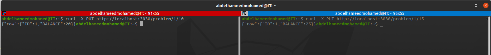
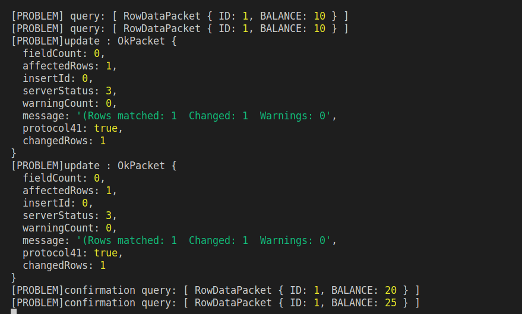
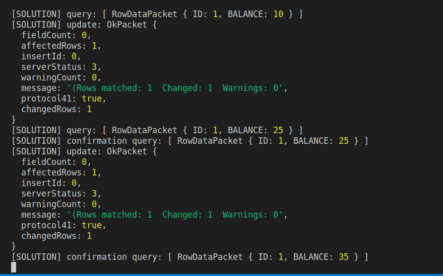

Today we are discussing a very important topic which is the pessimistic database concurrency control.
First of all, we need to understand the issues without concurrency control
let's assume we have a database column that has very important value, money for example

and based on this value we will take certain decisions
but how we can be 100% sure that no other transaction is currently messing up with a value?

## Use Case

we have a balance column in the wallet table
and we have an endpoint that connects to the DB and reads the latest balance value then increases it by 10$.

we could have multiple transactions increasing the balance at the same time
but in this case, all the transactions will override each other.
to prevent this issue we use a pessimistic lock over the columns that we need to update

## Locks

a pessimistic lock does intention exclusive record locking (IX) which means no other DB connection can read or write on this record until you finish working on it and commit the changes.
and to do so we use the `FOR UPDATE` keyword
```sql
SELECT * FROM WALLET WHERE ID=1 FOR UPDATE;
```
well, the above might be an issue in so many cases but in our case its an advantage
we need to prevent transactions from a race condition


## Tutorial

this example will be written using nodejs so it's better to be familiar with js
- make concurrency test DB on your local machine
- clone the tutorial [repository](https://github.com/hameed0z/concurrency-tutorial)
```bash
~:$ git clone https://github.com/hameed0z/concurrency-tutorial.git
```
- change the directory to the tutorial repo and create `.env` file
```bash
~:$ cd concurrency-tutorial
~:$ nano .env
```
- install the dependencies and run the app
```bash
~:$ npm i && npm start
```
at this point, you should have the app up and running on port `3030`

### Problem endpoint
I created a problem endpoint to be able to examine the problem
```js
// endpoint that have concurrency problem
app.put('/problem/:id/:balance', function (req, res) {
    const id = Number(req.params.id);
    const balance = Number(req.params.balance);
    pool.getConnection(function (err, connection) {
        connection.beginTransaction(function (err) {
            connection.query(`SELECT * FROM WALLET WHERE ID=${id};`, (error1, rows1) => {
                console.log('[PROBLEM] query:', rows1);
                connection.query(`UPDATE WALLET SET BALANCE = ${rows1[0].BALANCE + balance} WHERE ID = ${id};`, (error2, rows2) => {
                    console.log('[PROBLEM]update :', rows2);
                    connection.commit(function (err) {
                        if (err) {
                            return connection.rollback(function () {
                                throw err;
                            });
                        }
                        connection.query(`SELECT * FROM WALLET WHERE ID=${id};`, function (error3, rows3) {
                            console.log('[PROBLEM]confirmation query:', rows3);
                            res.json({ row: rows3[0] })
                        })
                    });

                })
            })
        })
    })
})
```
if this endpoint is called concurrently the request will override each other

### Problem endpoint results
Our starting point is the wallet table to have the value 10 in its column balance
I'm using terminator to broadcast multiple curl commands



As you can see after running 2 concurrent requests
our balance instead of having the value of 10+10+15 = 35
it has the value 25 because the second request overrides the first request
we can confirm this from the logs too




### Solution endpoint
I also created a solution endpoint to be able to examine the fix
```js
// endpoint has the concurrency problem solution
app.put('/solution/:id/:balance', function (req, res) {
    const id = Number(req.params.id);
    const balance = Number(req.params.balance);
    pool.getConnection(function (err, connection) {
        connection.beginTransaction(function (err) {
            // check the  `FOR UPDATE` keywords
            connection.query(`SELECT * FROM WALLET WHERE ID=${id} FOR UPDATE;`, function (error1, rows1) {
                console.log('[SOLUTION] query:', rows1);
                connection.query(`UPDATE WALLET SET BALANCE = ${rows1[0].BALANCE + balance} WHERE ID = ${id};`, (error2, rows2) => {
                    console.log('[SOLUTION] update:', rows2);
                    connection.commit(function (err) {
                        if (err) {
                            return connection.rollback(function () {
                                throw err;
                            });
                        }
                        connection.query(`SELECT * FROM WALLET WHERE ID=${id};`, function (error3, rows3) {
                            console.log('[SOLUTION] confirmation query:', rows3);
                            res.json({ row: rows3[0] })
                        })
                    });
                })
            })
        })
    })
})
```
if this endpoint is called concurrently the requests will run sequentially


### Solution endpoint results
Also here our starting point is the wallet table to have the value 10 in its column balance
I'm using terminator to broadcast multiple curl commands same as the problem endpoint example


As you can see after running 2 concurrent requests
the request with value 15 was processed first and returned the response of a balance equal to 25
then the second request with a value of 10 was processed and retune a value of 35
our balance has the value of 10+10+15 = 35
we can confirm this from the logs too

